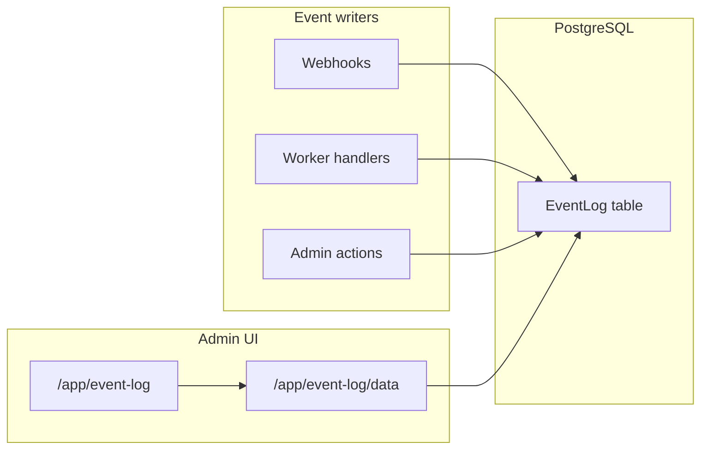

# Event Log Page — Plan

## Current state

- **No `EventLog` model or route** exists yet ([`prisma/schema.prisma`](prisma/schema.prisma) has no event table).
- Observability is split across **`InventorySyncRun`**, **`KornitxOrderIssue`**, **`SyncJob`**, and **`console.*`** — the Event Log will be a **new append-only operational feed**, not a replacement for Inventory Sync Log ([`/app/inventory/sync-log`](app/routes/app.inventory_.sync-log.tsx)).
- Pagination/refresh behavior should follow [`.cursor/plans/Event_log_load_more.md`](.cursor/plans/Event_log_load_more.md) (head/tail merge, cursor pagination) with **30s poll** (not 10s) per your spec.



---

## 1. Event catalog (what to log)

Below is the recommended **v1 event set**, grouped by your five categories. Each row: **event name** → **level** → **when / message pattern**.

### Category: Order From Kornitx

| Event name | Level | Trigger |
|---|---|---|
| `kornitx_order_received` | **Success** | New order saved from [`webhooks.kornitx.orders.tsx`](app/routes/webhooks.kornitx.orders.tsx) via [`saveInboundOrders`](app/models/kornitx-inbound.server.ts) |
| `kornitx_order_reingested` | **Warn** | Previously **failed** order re-received and reset to `received` |
| `kornitx_order_duplicate_ignored` | **Info** | Duplicate webhook for non-failed order (idempotent accept, no re-queue) |
| `kornitx_webhook_auth_failed` | **Error** | Auth failure in [`verifyKornitxWebhookAuth`](app/services/kornitx-webhook-auth.server.ts) |
| `kornitx_webhook_invalid_json` | **Error** | Malformed JSON body |
| `kornitx_webhook_validation_failed` | **Error** | [`KornitxParseError`](app/services/order.parser.ts) |
| `kornitx_webhook_unexpected_error` | **Error** | Unhandled 500 in webhook handler |
| `shopify_order_created` | **Success** | [`processKornitxOrder`](workers/lib/process-kornitx-order.ts) completes — include Shopify order name |
| `shopify_order_already_created` | **Info** | Worker finds order already `created` ([`handleProcessOrderJob`](workers/lib/handlers/process-order-job.ts)) |
| `shopify_order_processing_started` | **Info** | Order moved to `processing` |
| `shopify_order_creation_retry_scheduled` | **Warn** | Retryable failure — include attempt # and **next retry at** ([`failSyncJobWithBackoff`](workers/lib/sync-jobs.ts)) |
| `shopify_order_creation_failed_terminal` | **Error** | Terminal failure — include reason; no next retry ([`markOrderFailed`](workers/lib/orders.ts)) |
| `shopify_order_manual_retry` | **Info** | Merchant clicks **Retry** on orders page ([`retryFailedOrder`](app/models/kornitx-orders.server.ts)) |

**Order linkage fields** (for search + links): `kornitxId`, `shopifyOrderId`, `shopifyOrderName`.

---

### Category: Inventory Delta

| Event name | Level | Trigger |
|---|---|---|
| `inventory_delta_stored` | **Info** | [`upsertUnsentInventoryDelta`](app/models/inventory-delta.server.ts) after [`webhooks.inventory.levels_update`](app/routes/webhooks.inventory.levels_update.tsx) |
| `inventory_delta_webhook_skipped` | **Info** | Untracked variant / missing fields (optional — keep volume low) |
| `inventory_delta_sync_deferred` | **Info** | Sync interval not due — deferred run ([`handleSendInventoryDeltaJob`](workers/lib/handlers/send-inventory-delta-job.ts)) |
| `inventory_delta_sync_skipped` | **Info** | No unsent deltas |
| `inventory_delta_sync_success` | **Success** | Full batch sent — include EAN count |
| `inventory_delta_sync_partial` | **Warn** | Partial send — include sent/failed counts + **next retry at** |
| `inventory_delta_sync_failed_retry` | **Warn** | Total failure with backoff — **next retry at** ([`recordInventorySyncOutcome`](workers/lib/inventory-sync-observability.ts)) |
| `inventory_delta_sync_failed_terminal` | **Error** | Config/terminal failure (Ref ID, API key, location) |

---

### Category: Full feed inventory

| Event name | Level | Trigger |
|---|---|---|
| `full_feed_enqueued` | **Info** | Daily job enqueued ([`enqueueDailyFullFeedJobsIfDue`](app/models/sync-jobs.server.ts) / [`worker:stock-full-feed`](workers/stock-full-feed.ts)) |
| `full_feed_skipped_disabled` | **Info** | Daily full feed disabled in settings |
| `full_feed_skipped_no_products` | **Info** | No tracked products |
| `full_feed_skipped_no_remaining` | **Info** | Retry resume with empty remaining EANs |
| `full_feed_sync_success` | **Success** | All batches sent — include EAN count |
| `full_feed_sync_partial` | **Warn** | Partial batch failure — **next retry at**, remaining EAN count |
| `full_feed_sync_failed_retry` | **Warn** | Backoff retry scheduled |
| `full_feed_sync_failed_terminal` | **Error** | Terminal failure |

---

### Category: Shipment (fulfillment → KornitX)

| Event name | Level | Trigger |
|---|---|---|
| `fulfillment_webhook_received` | **Info** | [`webhooks.orders.fulfilled`](app/routes/webhooks.orders.fulfilled.tsx) / partially_fulfilled / cancelled |
| `shipping_event_created` | **Info** | New `dispatched` or `cancelled` [`ShippingStatusEvent`](app/models/shipping-events.server.ts) |
| `shipping_event_deduped` | **Info** | Duplicate event ignored (optional, low volume) |
| `fulfillment_send_deferred` | **Info** | 20-min delay not elapsed ([`isFulfillmentSendDue`](shared/fulfillment-sync.ts)) |
| `fulfillment_send_success` | **Success** | Statuses sent to KornitX — include count |
| `fulfillment_send_nothing_to_send` | **Info** | No unsent events |
| `fulfillment_send_retry_scheduled` | **Warn** | Retryable send failure — **next retry at** |
| `fulfillment_send_failed_terminal` | **Error** | Terminal send failure |
| `fulfillment_manual_resend` | **Info** | Merchant **Resend** on orders page ([`resendFulfillmentForOrder`](app/models/kornitx-orders.server.ts)) |

---

### Category: Syncjob (worker infrastructure)

| Event name | Level | Trigger |
|---|---|---|
| `sync_job_completed` | **Info** | Generic job completion in [`dispatchSyncJob`](workers/lib/dispatch-sync-job.ts) — include `jobType` in metadata |
| `sync_job_backfill_enqueued` | **Info** | [`backfillProcessOrderJobs`](workers/lib/backfill-jobs.ts) enqueued N orders |
| `sync_job_stale_reclaimed` | **Warn** | Stale `processing` job reclaimed ([`reclaimStaleSyncJobs`](workers/lib/sync-jobs.ts)) |
| `sync_job_unhandled_error` | **Error** | Unhandled exception during dispatch |
| `worker_cycle_summary` | **Info** | Optional end-of-cycle stats from [`run-jobs.ts`](workers/run-jobs.ts) (keep concise to avoid noise) |

**v1 scope note:** Log **meaningful business outcomes** above; avoid logging every poll tick. `sync_job_completed` can be suppressed when the handler already emitted a domain-specific event (e.g. skip logging generic completion after `shopify_order_created`).

---

## 2. Data model

Add to [`prisma/schema.prisma`](prisma/schema.prisma):

```prisma
model EventLog {
  id               Int      @id @default(autoincrement())
  shop             String
  level            String   // info | success | warn | error
  category         String   // inventory_delta | full_feed_inventory | order_from_kornitx | sync_job | shipment
  eventName        String
  message          String
  kornitxOrderId   String?  // KornitX external id for search
  shopifyOrderId   String?
  shopifyOrderName String?
  syncJobId        Int?
  metadata         Json?
  createdAt        DateTime @default(now())

  @@index([shop, createdAt(sort: Desc), id(sort: Desc)])
  @@index([shop, level, createdAt(sort: Desc)])
  @@index([shop, category, createdAt(sort: Desc)])
  @@index([shop, shopifyOrderName])
  @@index([shop, kornitxOrderId])
}
```

Shared constants in new [`shared/event-log.ts`](shared/event-log.ts): `EVENT_LOG_LEVELS`, `EVENT_LOG_CATEGORIES` (with display labels matching your dropdowns), `ADMIN_EVENT_LOG_PAGE_SIZE = 50`, `EVENT_LOG_POLL_INTERVAL_MS = 30_000`.

---

## 3. Write path

New [`app/models/event-log.server.ts`](app/models/event-log.server.ts):

- `writeEventLog(input)` — single insert helper used by webhooks, workers, and admin actions
- `fetchEventLogsPageForAdmin(shop, filters, cursor?)` — Prisma query: `orderBy: [{ createdAt: 'desc' }, { id: 'desc' }]`, `take: 50`, cursor `{ id }` + `skip: 1` for load-more
- Filter helpers in [`shared/event-log-filters.ts`](shared/event-log-filters.ts): `level`, `category`, `q` (order search), `dateFrom`, `dateTo`
- Date bounds in [`shared/event-log-date-range.ts`](shared/event-log-date-range.ts): `createdAtBoundsFromDateFilters()` using **Europe/London** calendar days (reuse patterns from [`shared/uk-time.ts`](shared/uk-time.ts))

**Instrumentation touchpoints** (call `writeEventLog` at outcome boundaries):

| Area | Files |
|---|---|
| Kornitx inbound | [`webhooks.kornitx.orders.tsx`](app/routes/webhooks.kornitx.orders.tsx), [`kornitx-inbound.server.ts`](app/models/kornitx-inbound.server.ts) |
| Order processing | [`process-order-job.ts`](workers/lib/handlers/process-order-job.ts), [`process-kornitx-order.ts`](workers/lib/process-kornitx-order.ts), [`kornitx-orders.server.ts`](app/models/kornitx-orders.server.ts) |
| Inventory delta / full feed | [`send-inventory-delta-job.ts`](workers/lib/handlers/send-inventory-delta-job.ts), [`send-inventory-full-feed-job.ts`](workers/lib/handlers/send-inventory-full-feed-job.ts), [`inventory-sync-observability.ts`](workers/lib/inventory-sync-observability.ts) |
| Shipment | [`order-fulfillment-webhook.server.ts`](app/services/order-fulfillment-webhook.server.ts), [`send-fulfillment-job.ts`](workers/lib/handlers/send-fulfillment-job.ts), [`kornitx-orders.server.ts`](app/models/kornitx-orders.server.ts) |
| Worker infra | [`run-jobs.ts`](workers/run-jobs.ts), [`dispatch-sync-job.ts`](workers/lib/dispatch-sync-job.ts) |

---

## 4. Admin UI

### Routes

| Route | Purpose |
|---|---|
| `/app/event-log` | Main page — loader returns first page + filters |
| `/app/event-log/data` | JSON resource for poll + load-more (`useFetcher`) |

Add nav link in [`app/routes/app.tsx`](app/routes/app.tsx).

### Page layout (match Seko screenshots)

- **Header:** "Event log" + **Refresh now** button + last-refresh timestamp
- **Info banner:** "Operational feed — structured application events (newest first). Refreshes every 30 seconds. 50 per page — use Load more for older matches."
- **Filter bar** (URL-driven, Clear resets all):
  - **Level** dropdown: All / Error / Success / Warn / Info
  - **Category** dropdown: All / Inventory Delta / Full feed inventory / Order From Kornitx / Syncjob / Shipment
  - **Date range** — port Seko pattern:
    - [`FilterDateRangeField`](app/components/layout/filter-date-range-field.tsx) (read-only field + popover trigger)
    - `<s-popover>` + `<s-date-picker type="range">` value `YYYY-MM-DD--YYYY-MM-DD`
    - [`PopoverHideTrigger`](app/components/layout/popover-hide-trigger.tsx) closes after range picked
    - URL: `?dateFrom=2026-06-01&dateTo=2026-06-11`
  - **Order search** — `s-search-field`, debounced **500ms** (pattern from [`orders-filters.tsx`](app/components/orders/orders-filters.tsx) but 500ms timer)
- **Event cards:** level badge + category label + monospace `eventName` + UK timestamp ([`formatUkDateTime`](shared/uk-time.ts)) + message with order link to `/app/orders?q=...` when order fields present
- **Load more** button at bottom when `hasMore === true`

### Client state (from load-more plan)

New [`app/lib/event-log-feed.client.ts`](app/lib/event-log-feed.client.ts):

- `headEvents` — latest page (loader + poll)
- `tailEvents` — pages from Load more
- `mergeEventLogFeedDisplay(head, tail)` — dedupe by id
- `appendEventLogTailPage(tail, page)` — append on load-more
- **Filter change** → reset `tailEvents`
- **Poll every 30s** → refresh head only via fetcher; displaced head rows move to tail so nothing disappears
- **Refresh now** → same as poll (reload head page 1)

CSS module mirroring inventory/orders filter card styling.

---

## 5. Search & filter semantics

**Order search (`q`):** case-insensitive match on any of:

- `shopifyOrderName` (e.g. `#1234` or order name)
- `shopifyOrderId` (Shopify GID numeric portion)
- `kornitxOrderId` (KornitX external id)

Use Prisma `OR` with `contains` / `startsWith` as appropriate.

**Date range:** inclusive London calendar days on `EventLog.createdAt` — e.g. `dateFrom=2026-06-01` means from start of 1 Jun London, not UTC midnight.

---

## 6. Documentation

Per workspace rules, after implementation update:

- [`About_App_Readme.md`](About_App_Readme.md) — new route, EventLog model, poll/load-more behavior
- [`Learn.md`](Learn.md) — event write paths, filter URL params, head/tail merge flow

---

## 7. Out of scope (v1)

- Backfilling historical events from `InventorySyncRun` / `KornitxOrderIssue` (optional follow-up)
- Seko-style `WEBHOOK` / `ORDER` categories for Shopify `orders/updated` (this app has no such webhook today)
- Event detail drawer / JSON metadata expansion (can add later)
- Retention/TTL policy for old rows (define separately if needed)

---

## Implementation order

1. Prisma model + migration + shared constants/filters/date helpers
2. `writeEventLog` + `fetchEventLogsPageForAdmin`
3. `/app/event-log` page + `/app/event-log/data` resource + feed merge client logic
4. Filter components (level, category, date range, order search)
5. Instrument all v1 writers (webhooks → workers → admin actions)
6. Nav link + docs update
