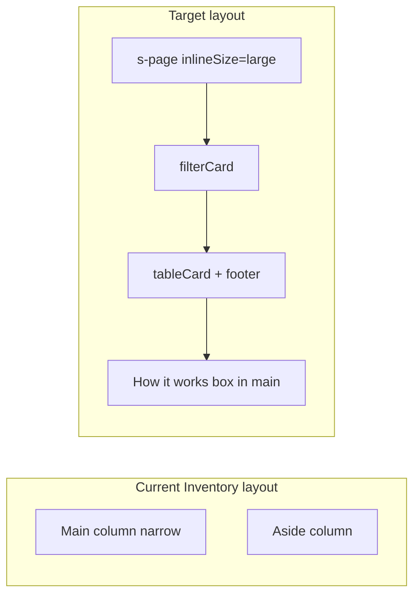

# Inventory & Settings Full-Width + Inventory Pagination

## Current state

| Page | Width | Sidebar | Pagination |
|------|-------|---------|------------|
| [app/routes/app.orders.tsx](app/routes/app.orders.tsx) | `inlineSize="large"` | None | URL `page` / `pageSize`, server Prisma skip/take |
| [app/routes/app.inventory.tsx](app/routes/app.inventory.tsx) | Default (narrow) | `How it works` aside | None — renders all `filteredVariants` |
| [app/routes/app.settings.tsx](app/routes/app.settings.tsx) | Default (narrow) | `Inbound webhook` aside | N/A |

The Inventory loader in [app/routes/app.inventory.tsx](app/routes/app.inventory.tsx) always fetches **all barcoded variants** from Shopify via `fetchProductVariantsWithInventory` on every GET navigation (including filter URL changes). Pagination will improve **UI performance** but will not reduce Shopify API volume unless we add a separate optimization later.

---

## Phase 1 — Full-width layout (Inventory + Settings)

### Shared pattern (match Orders)

Apply the same shell used by Orders:

```tsx
<s-page heading="..." inlineSize="large">
  <div className={styles.page}>
    {/* content cards */}
  </div>
</s-page>
```

### Settings ([app/routes/app.settings.tsx](app/routes/app.settings.tsx))

1. Add `inlineSize="large"` to `<s-page>`.
2. Remove `<s-section slot="aside" heading="Inbound webhook">`.
3. Add a new main-column section after the existing form sections (e.g. `heading="Inbound webhook"`) with the same content (webhook URL box + env/worker notes).
4. Optionally add minimal page wrapper CSS in [app/components/settings/settings-page.module.css](app/components/settings/settings-page.module.css) (`width: 100%`) — no card/table layout needed for a form page.

### Inventory ([app/routes/app.inventory.tsx](app/routes/app.inventory.tsx))

1. Add `inlineSize="large"` to `<s-page>`.
2. Remove `<s-section slot="aside" heading="How it works">`.
3. Relocate the bullet list into the main column — e.g. a subdued `<s-box>` below the intro paragraph or after the table.
4. Restructure main content to mirror Orders layout:
   - Wrap filters in `.filterCard`
   - Wrap table + pagination footer in `.tableCard` > `.tableWrap`
5. Extend [app/components/inventory/inventory-page.module.css](app/components/inventory/inventory-page.module.css) with card/footer/table styles copied from [app/components/orders/orders-page.module.css](app/components/orders/orders-page.module.css) (`.page`, `.filterCard`, `.tableCard`, `.tableWrap`, `.footer`, `.pageSize`, `.pagination`, etc.).



---

## Phase 1 — Inventory pagination (Orders-like UX)

### Approach: client-side slice + URL params + skip revalidation

Copy the **visible** pagination UX from Orders (page size select, Previous/Next, "Page X of Y"), but slice data **in the browser** because:

- The loader already holds the full variant list.
- A naïve copy of Orders' GET-based page navigation would **re-run the Shopify fetch on every page click** — worse than today.

**Data pipeline (new):**

```
loader variants
  → sort (Phase 2 only; skipped in Phase 1)
  → filterInventoryVariants(...)
  → slice for current page
  → render table rows
```

### URL params

Extend [shared/inventory-list-filters.ts](shared/inventory-list-filters.ts):

- Add `page` (default 1) and `pageSize` (default 10, allowed: 10 | 25 | 50) to `InventoryListFilters`.
- Add `parseInventoryPagination()` or extend `parseInventoryListFilters()` mirroring [app/models/kornitx-orders.server.ts](app/models/kornitx-orders.server.ts) `parseOrderListFilters` (lines 286–302).
- Add helper `paginateItems<T>(items, page, pageSize)` returning `{ items, totalCount, totalPages }`.

### Route changes ([app/routes/app.inventory.tsx](app/routes/app.inventory.tsx))

- Parse `page` / `pageSize` from `useSearchParams()`.
- Compute `paginatedVariants` from `filteredVariants`.
- Add footer UI (copy structure from Orders lines 273–311).
- Add `goToPage` / `handlePageSizeChange` handlers (same URL conventions: omit default values, reset page on pageSize change).
- Wire `isLoading = navigation.state === "loading"` to disable pagination buttons and show table loading state.
- Reset `page` to 1 when filters change — update [app/components/inventory/inventory-filters.tsx](app/components/inventory/inventory-filters.tsx) `updateParams` and `clearFilters` to `params.delete("page")` (same as Orders filters).

### Prevent Shopify re-fetch on page-only navigation

Add `shouldRevalidate` export to [app/routes/app.inventory.tsx](app/routes/app.inventory.tsx):

```typescript
export function shouldRevalidate({ currentUrl, nextUrl, defaultShouldRevalidate }) {
  const stripPageParams = (url: URL) => {
    const p = new URLSearchParams(url.searchParams);
    p.delete("page");
    p.delete("pageSize");
    return p.toString();
  };
  if (stripPageParams(currentUrl) === stripPageParams(nextUrl)) {
    return false; // page/pageSize only — keep cached loader data
  }
  return defaultShouldRevalidate;
}
```

This keeps URL bookmarkability while avoiding redundant Shopify calls when paginating.

### Edge cases

- Empty filtered list: show existing empty-state box; hide pagination footer.
- After Save (POST): loader re-runs normally; stay on current page if valid, or clamp page if count shrank.
- Search typing: already client-side; debounced URL sync should also reset page when `q` changes (add `params.delete("page")` in debounced `updateParams` call).

---

## Phase 2 — Tracked items first (after Save only)

### Behavior

| Moment | Sort key | Checkbox state |
|--------|----------|----------------|
| Initial load / reload | Saved DB tracked IDs (`trackedVariantIds` from loader) | Seeded from saved |
| User toggles Track checkbox | **No reorder** — sort still uses saved IDs | Draft `selected` Set |
| User clicks Save selection | Loader re-runs; sort uses updated saved IDs | Reset `selected` from new loader data |

### Implementation

1. Add `sortInventoryVariantsWithTrackedFirst()` in [shared/inventory-list-filters.ts](shared/inventory-list-filters.ts):
   - Input: variants + **saved** `trackedVariantIds` Set (not draft `selected`).
   - Tracked variants first; stable secondary sort by `productTitle` + `variantTitle` (locale-aware `localeCompare`).
2. Update pipeline in [app/routes/app.inventory.tsx](app/routes/app.inventory.tsx):

```typescript
const sortedVariants = useMemo(
  () => sortInventoryVariantsWithTrackedFirst(variants, new Set(trackedVariantIds)),
  [variants, trackedVariantIds],
);
const filteredVariants = useMemo(
  () => filterInventoryVariants(sortedVariants, activeFilters, selected),
  [sortedVariants, activeFilters, selected],
);
```

3. Sync draft selection after save — add effect so checkboxes match DB after successful POST:

```typescript
useEffect(() => {
  setSelected(new Set(trackedVariantIds));
}, [trackedVariantIds]);
```

4. **Tracking filter** continues to use draft `selected` (current behavior) so users can preview unsaved changes; only **sort order** uses saved IDs.

### Tests

Add unit tests for sort + pagination helpers in a new file e.g. `shared/inventory-list-filters.test.ts` (or extend existing test patterns if present).

---

## Documentation (on implementation)

Per project rules, update both:

- [About_App_Readme.md](About_App_Readme.md) — note full-width Inventory/Settings, inventory pagination, Phase 2 tracked-first ordering.
- [Learn.md](Learn.md) — document URL params (`page`, `pageSize`), client-side slice flow, `shouldRevalidate`, and tracked-first sort timing.

---

## Files to touch

| File | Phase | Change |
|------|-------|--------|
| [app/routes/app.inventory.tsx](app/routes/app.inventory.tsx) | 1 + 2 | Layout, pagination, sort pipeline, `shouldRevalidate` |
| [app/routes/app.settings.tsx](app/routes/app.settings.tsx) | 1 | `inlineSize="large"`, move webhook section |
| [app/components/inventory/inventory-page.module.css](app/components/inventory/inventory-page.module.css) | 1 | Card/table/footer styles |
| [app/components/inventory/inventory-filters.tsx](app/components/inventory/inventory-filters.tsx) | 1 | Reset page on filter changes |
| [shared/inventory-list-filters.ts](shared/inventory-list-filters.ts) | 1 + 2 | Pagination parse/slice; tracked-first sort |
| [About_App_Readme.md](About_App_Readme.md), [Learn.md](Learn.md) | 1 + 2 | Feature docs |

No backend/API changes required — pagination and sort are client-side over existing loader data.
