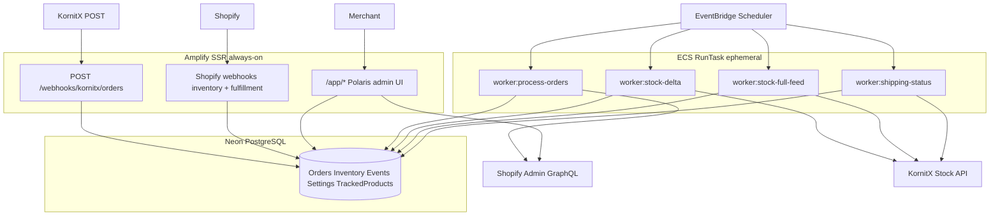

# KornitX ↔ Shopify Connector — Consolidated Plan

Based on [plan.md](../../plan.md) (Claude / seko-connector pattern), the [KornitX spec](../../Chinti_Parker_Ltd_API_Non-stocked_supplier_integration_1_0.md), and gaps identified during review.

---

## Architecture (confirmed)



| Layer | Role |
|-------|------|
| **Amplify** | Embedded Shopify app UI, KornitX inbound webhook, Shopify webhooks — validate, persist, return fast |
| **Neon Postgres** | Shared state — Prisma |
| **ECS RunTask** | Ephemeral workers — EventBridge invokes `npm run worker:<job>`, task runs, exits |
| **EventBridge Scheduler** | One rule per job with container command override |
| **Secrets Manager** | KornitX REFID/key, webhook auth, Shopify secrets |

**On ECS RunTask overhead (BUT #6):** Not a concern for this project. Tasks run every 5–30 minutes; a few seconds of cold start is irrelevant. Ephemeral tasks avoid paying for a 24/7 worker container — appropriate here.

---

## Tech stack

- **Scaffold:** Shopify React Router template (`shopify app init --template=react-router`) deployed to **Amplify SSR**
- **UI:** Polaris Web Components (`<s-page>`, `<s-index-table>`, `<s-checkbox>`)
- **API:** Admin GraphQL via `authenticate.admin(request)`
- **ORM:** Prisma + Neon (pooled connection string for concurrent RunTasks)
- **Workers:** Same Docker image, different `npm run worker:*` commands per EventBridge rule

---

## Database schema (Prisma)

Merge Claude schema with missing models:

```prisma
model AppSettings {
  id                      Int      @id @default(autoincrement())
  shop                    String   @unique
  kornitxRefId            String
  deltaIntervalMinutes    Int      @default(25)
  inventoryLocationId     String   // Shopify location GID for Next stock
  b2bCustomerId           String   // Shopify customer GID
  defaultShippingAddress  Json     // Next RDC address
  inboundAuthType         String   @default("basic")
  preemptiveOrderPrefix   String?  // 2-letter prefix when Next confirms
  // API keys in Secrets Manager; store secret ARNs or env refs only
}

model TrackedProduct {
  id           Int      @id @default(autoincrement())
  shop         String
  variantId    String
  ean          String   // barcode
  sku          String?
  productTitle String
  enabled      Boolean  @default(true)
  @@unique([shop, variantId])
}

model KornitxOrder {
  id              Int      @id @default(autoincrement())
  kornitxId       String   @unique // KornitX batch "ID"
  brand           String
  destination     String
  currency        String
  dateTimeStamp   DateTime
  orderShape      String   // single | batched
  status          String   // received | processing | created | failed
  shopifyOrderId  String?
  orderReceivedAt DateTime @default(now())
  failureReason   String?
  items           KornitxOrderItem[]
  shippingEvents  ShippingStatusEvent[]
}

model KornitxOrderItem {
  id               Int          @id @default(autoincrement())
  orderId          Int
  order            KornitxOrder @relation(fields: [orderId], references: [id])
  itemId           String       // KornitX ItemID
  ean              String
  quantity         Int
  promiseDate      String
  orderExternalRef String
  shopifyLineItemId String?
  @@unique([orderId, itemId])
}

model InventorySyncState {
  id                Int            @id @default(autoincrement())
  trackedProductId  Int            @unique
  trackedProduct    TrackedProduct @relation(fields: [trackedProductId], references: [id])
  pendingQuantity   Int
  lastSentQuantity  Int?
  lastChangedAt     DateTime
  lastSentAt        DateTime?
  needsSync         Boolean        @default(false)
}

model ShippingStatusEvent {
  id              Int          @id @default(autoincrement())
  shopifyOrderId  String
  shopifyLineItemId String?
  kornitxOrderId  Int
  order           KornitxOrder @relation(fields: [kornitxOrderId], references: [id])
  kornitxItemId   String?      // for batched status API
  status          String       // dispatched | cancelled
  eventAt         DateTime     @default(now())
  sent            Boolean      @default(false)
  sentAt          DateTime?
  @@unique([shopifyOrderId, shopifyLineItemId, status]) // dedupe webhooks
}

model JobRun {
  id         Int       @id @default(autoincrement())
  jobName    String
  status     String    // running | completed | failed
  startedAt  DateTime  @default(now())
  finishedAt DateTime?
  error      String?
}
```

---

## BUT fixes (solutions included)

### BUT #1 — Amplify must be always-on
**Solution:** Accepted. Amplify hosts UI + all webhooks. Stable HTTPS URL for KornitX: `https://connector.chintiparker.com/webhooks/kornitx/orders`. Same base URL in `shopify.app.toml`.

### BUT #2 — Missing admin UI
**Solution:** Add embedded Polaris pages on Amplify:

| Route | Purpose |
|-------|---------|
| `/app` | Dashboard — recent orders, failed jobs, sync health |
| `/app/settings` | KornitX creds, B2B customer, Next RDC address, inventory location, delta interval |
| `/app/inventory` | Product index table with checkboxes → `TrackedProduct` |
| `/app/orders` | KornitxOrder log, retry failed, view SyncLog/JobRun |

### BUT #3 — Missing Shopify order creation details
**Solution:** `worker:process-orders` implements:

1. Resolve variant by **barcode = EAN** (GraphQL `productVariants` query)
2. **`orderCreate`** with settings from `AppSettings`:
   - Fixed B2B customer + Next RDC shipping address
   - One Shopify order per KornitX batch; one line item per KornitX item, qty 1
   - Tags: `kornitx`, `next-label-plus`, `ext-ref:{OrderExternalRef}`
   - Order metafields: `kornitx_batch_id`, `destination`, `promise_date`
   - Line item metafields: `kornitx_item_id`, `order_external_ref`
3. Store `shopifyOrderId` + `shopifyLineItemId` on success; `status=failed` + alert on error

### BUT #4 — Batched vs single payload shapes
**Solution:** Parser detects shape:

- **Single:** one order, one item, `OrderExternalRef` at order level → `orderShape=single`, shipping uses `PUT /order/:kornitxId/status` (8/128)
- **Batched:** one order, multiple items, `OrderExternalRef` per item → `orderShape=batched`, shipping uses `PUT /order-item/status` with each `ItemID` (3/7)

Store `orderExternalRef` on each `KornitxOrderItem` regardless of payload level.

### BUT #5 — Shipping status + partial fulfillment
**Solution:**

- Register `ORDERS_FULFILLED` + `ORDERS_CANCELLED` (confirm exact topics with 3PL during build)
- Webhook maps fulfilled **line items** → `KornitxOrderItem` via metafields or SKU/EAN
- Insert `ShippingStatusEvent` only if not exists (unique constraint dedupes)
- `worker:shipping-status` joins `KornitxOrder.orderReceivedAt`, sends only when `now >= orderReceivedAt + 20 min`
- Partial fulfillment: send status per fulfilled `ItemID` in batched orders; whole-order status for single-item orders

### BUT #7 — InventoryChange table bloat
**Solution:** No raw `InventoryChange` log for every SKU. Use **`InventorySyncState`** per tracked product:

- Webhook: resolve variant → check `TrackedProduct.enabled` → if yes, upsert `InventorySyncState` (`pendingQuantity`, `needsSync=true`)
- Ignore untracked products entirely

### BUT #8 — Shipping event idempotency
**Solution:** `@@unique([shopifyOrderId, shopifyLineItemId, status])` on `ShippingStatusEvent`. Webhook handler uses upsert/skip-if-exists.

### IF #3 — KornitX ack semantics
**Solution (Claude approach, documented):**

- Amplify webhook returns **200 on valid payload + DB save** (`status=received`)
- Does **not** wait for Shopify order create
- `worker:process-orders` handles Shopify; failures → `status=failed`, dashboard alert, manual retry UI
- **Confirm with KornitX during UAT** that ack = accepted for processing. If they require Shopify order first, switch worker to sync-before-ack or reduce schedule to 1 min.

---

## Integration flows

### Inbound orders (Amplify)

`POST /webhooks/kornitx/orders`

1. Verify Basic/OAuth2 auth
2. Validate JSON (mandatory fields per spec)
3. Upsert on `kornitxId` (idempotent for KornitX retries up to 5×)
4. Insert items; set `orderReceivedAt=now()`, `status=received`
5. Return 200 (accepted) or 400/500 with reason code

### Process orders (ECS worker, every 5 min)

`npm run worker:process-orders`

1. Atomic claim: `UPDATE ... SET status='processing' WHERE status='received' RETURNING *`
2. Run orderCreate flow (BUT #3)
3. Mark `created` or `failed`; write `JobRun`

### Inventory webhook (Amplify)

`INVENTORY_LEVELS_UPDATE`

1. Resolve variant + EAN
2. If in `TrackedProduct` → upsert `InventorySyncState`, `needsSync=true`
3. Return 200 immediately — no KornitX call

### Stock delta (ECS worker, every 25 min default)

`npm run worker:stock-delta`

1. Query `InventorySyncState WHERE needsSync=true`
2. Batch ≤100 EANs; PUT absolute qty to KornitX stock API
3. On success: update `lastSentQuantity`, `lastSentAt`, `needsSync=false`
4. Handle KornitX error codes 401, 50000, 50001 explicitly

### Stock full feed (ECS worker, daily)

`npm run worker:stock-full-feed`

1. All enabled `TrackedProduct` — read current Shopify inventory at configured location
2. Send full feed in ≤100 EAN chunks (spec requirement)

### Fulfillment webhook (Amplify)

`ORDERS_FULFILLED` / `ORDERS_CANCELLED`

1. Map to `KornitxOrder` + items
2. Insert `ShippingStatusEvent` (deduped)
3. Return 200

### Shipping status (ECS worker, every 5 min)

`npm run worker:shipping-status`

1. Select events where `sent=false` AND `now >= order.orderReceivedAt + 20 min`
2. Send dispatch/cancel via correct API (single vs batched per `orderShape`)
3. Mark `sent=true`, `sentAt=now()`

---

## EventBridge Scheduler rules

One ECS task definition, one image, command override per rule:

| Rule | Schedule | Command |
|------|----------|---------|
| process-orders | `rate(5 minutes)` | `npm run worker:process-orders` |
| stock-delta | `rate(25 minutes)` | `npm run worker:stock-delta` |
| stock-full-feed | `cron(0 2 * * ? *)` | `npm run worker:stock-full-feed` |
| shipping-status | `rate(5 minutes)` | `npm run worker:shipping-status` |

Use Neon **pooled** connection string. Optional `JobRun` row per execution for observability.

---

## Shopify scopes and webhooks

**Scopes:** `read_products`, `read_inventory`, `write_orders`, `read_orders`, `read_customers`, `read_fulfillments`

**Webhooks (registered on install):**

- `INVENTORY_LEVELS_UPDATE`
- `ORDERS_FULFILLED`
- `ORDERS_CANCELLED`

---

## Project structure

```
app/
  routes/
    app._index.tsx
    app.settings.tsx
    app.inventory.tsx
    app.orders.tsx
    webhooks.kornitx.orders.tsx
    webhooks.inventory_levels.update.tsx
    webhooks.orders.fulfilled.tsx
    webhooks.orders.cancelled.tsx
  services/
    kornitx.client.ts
    shopify.orders.ts
    shopify.inventory.ts
    order.parser.ts
workers/
  process-orders.ts
  stock-delta.ts
  stock-full-feed.ts
  shipping-status.ts
prisma/schema.prisma
Dockerfile                    # shared by Amplify build + ECS task image
amplify.yml                   # Amplify SSR deploy config
infra/                        # ECS task def + EventBridge rules (CDK/Terraform)
```

---

## Open questions (confirm before UAT)

- KornitX inbound auth: Basic vs OAuth2
- Exact stock delta interval (20–30 min — default 25)
- Ack semantics: queued vs Shopify-created
- RefID + API key for UAT vs prod
- Next RDC address + B2B customer GID + pricing/tax on `orderCreate`
- 3PL fulfillment granularity (line vs whole order)
- Pre-emptive order `OrderExternalRef` 2-letter prefix

---

## Implementation phases

1. **Scaffold** — Shopify app, Prisma/Neon, Amplify deploy, Dockerfile for workers
2. **Settings + Inventory UI** — AppSettings, TrackedProduct checkbox page
3. **KornitX inbound + process-orders worker** — webhook + Shopify orderCreate
4. **Inventory pipeline** — inventory webhook + stock delta/full workers
5. **Fulfillment pipeline** — fulfillment webhooks + shipping-status worker
6. **ECS + EventBridge + Secrets** — worker infra, alerting, UAT with KornitX

---

## What changed vs Claude plan.md alone

| Added | From review |
|-------|-------------|
| `TrackedProduct` + inventory UI | Product selection requirement |
| `InventorySyncState` replaces raw `InventoryChange` | BUT #7 |
| `AppSettings` | B2B customer, location, intervals |
| Admin UI pages (4 routes) | BUT #2 |
| Full orderCreate spec | BUT #3 |
| Order shape + shipping API routing | BUT #4, #5 |
| Shipping event dedupe constraint | BUT #8 |
| Polaris Web Components | User requirement |
| Explicit BUT/IF solutions | This review |

Kept from Claude: Amplify + ephemeral ECS RunTask, webhook-fast/worker-slow split, ack-on-validity, JobRun observability, claim pattern for workers.
