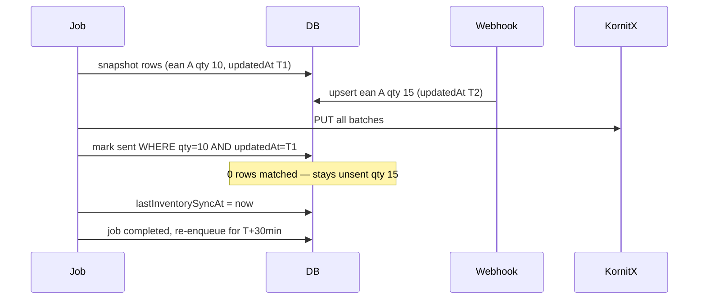
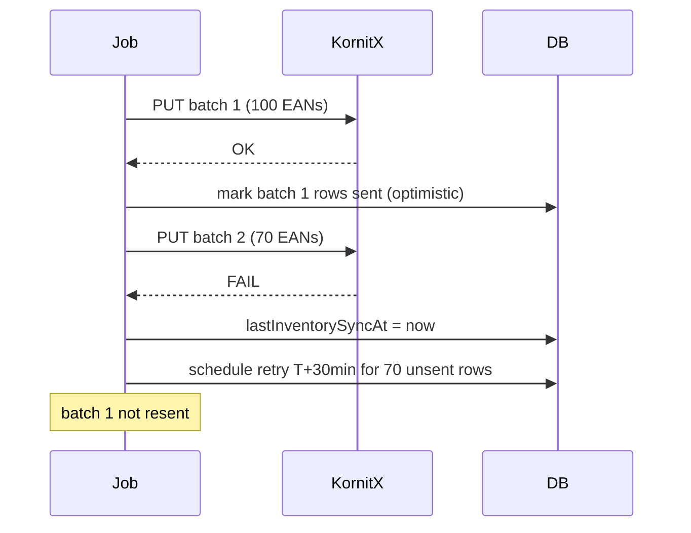

# Inventory delta sync hardening (Phase 1 + Phase 2)

Two related gaps in [`workers/lib/handlers/send-inventory-delta-job.ts`](workers/lib/handlers/send-inventory-delta-job.ts):

| Gap | Problem today | Phase |
|---|---|---|
| **Mid-run race** | Row changed during job still marked `sent` by ID | Phase 1 |
| **Partial batch failure** | Batch 1 at KornitX, batch 2 fails → nothing marked, backoff retry resends batch 1 within ~5 min | Phase 2 |

---

## Phase 1 — Mid-run optimistic commit

### Problem

After KornitX PUT succeeds, rows are marked `sent` by ID only:

```48:55:workers/lib/handlers/send-inventory-delta-job.ts
      await tx.inventoryDelta.updateMany({
        where: {
          shop: job.shop,
          status: "unsent",
          id: { in: unsent.map((row) => row.id) },
        },
        data: { status: "sent" },
      });
```

If a webhook upserts the same EAN mid-run (qty 10 → 15), the row's `updatedAt` and `quantity` change but the job still marks it `sent`. KornitX holds 10; DB thinks 15 is synced.

### Fix

Use snapshot **`updatedAt` + `quantity`** as compare-and-swap when marking sent (after all batches succeed):

```typescript
let markedCount = 0;
for (const row of unsent) {
  const result = await tx.inventoryDelta.updateMany({
    where: {
      id: row.id,
      shop: job.shop,
      status: "unsent",
      updatedAt: row.updatedAt,
      quantity: row.quantity,
    },
    data: { status: "sent" },
  });
  markedCount += result.count;
}
```

**Always update `lastInventorySyncAt`** when the full KornitX PUT succeeds — even if some rows fail the optimistic check:

```typescript
await tx.appSettings.updateMany({
  where: { shop: job.shop },
  data: { lastInventorySyncAt: now },
});
```

Skipping `lastInventorySyncAt` on partial optimistic failure would schedule an immediate re-run (~5 min poll) and **break the 30-min rule**. The clock tracks **KornitX API calls**; optimistic locking tracks **DB row state**.

**Trade-off:** race-affected EAN may be stale at KornitX for up to ~30 min until the next interval run.

### Phase 1 flow



### Phase 1 files

| File | Change |
|---|---|
| [`workers/lib/handlers/send-inventory-delta-job.ts`](workers/lib/handlers/send-inventory-delta-job.ts) | Optimistic per-row mark-sent at end; always update `lastInventorySyncAt`; logging |
| [`About_App_Readme.md`](About_App_Readme.md) | Note optimistic commit behavior |
| [`Learn.md`](Learn.md) | Document mid-run race handling |

### Phase 1 testing

1. Happy path — all marked sent, `lastInventorySyncAt` updated
2. Mid-run update — changed row stays unsent, others marked sent, `lastInventorySyncAt` updated, re-enqueued for +30 min
3. Interval preserved — re-enqueued job has `runAfter = lastInventorySyncAt + 30 min`, not `now`

No schema migration required.

---

## Phase 2 — Per-batch commits + interval retry for leftovers

### Problem (not fixed by Phase 1)

Today: send all batches first, mark only at end. If batch 2 fails:

- Batch 1 already at KornitX
- Nothing marked `sent`, `lastInventorySyncAt` not updated
- Retry via **`failSyncJobWithBackoff`** (~5 min) resends **both** batches → **breaks 30-min rule**

### Fix: combine per-batch commits + interval-based retry

Refactor the send loop (likely move logic from [`workers/lib/kornitx-stock.ts`](workers/lib/kornitx-stock.ts) into the handler or a shared helper that returns per-batch results):

**After each successful 100-EAN PUT:**

1. Optimistically mark **that batch's rows** sent (`updatedAt` + `quantity` check, same as Phase 1)
2. Continue to next batch

**If a later batch fails:**

1. Earlier batches already marked `sent` in DB
2. **Update `lastInventorySyncAt = now`** (KornitX did receive data)
3. **Do not** use exponential backoff for this case
4. Complete or release job with `runAfter = lastInventorySyncAt + 30 min` for remaining unsent rows
5. Re-enqueue via `enqueueSendInventoryDeltaJobIfNeeded` (will schedule at +30 min)

**If all batches succeed:** same as Phase 1 end state (optimistic mark any remaining, update `lastInventorySyncAt`, complete job).

### Performance

Negligible impact — KornitX HTTP dominates. Per-batch DB commits add ~100–300 ms for typical payloads (170 EANs); still one SyncJob execution per cycle.

### Phase 2 flow



### Phase 2 files

| File | Change |
|---|---|
| [`workers/lib/handlers/send-inventory-delta-job.ts`](workers/lib/handlers/send-inventory-delta-job.ts) | Per-batch send + optimistic mark loop; interval retry on partial failure |
| [`workers/lib/kornitx-stock.ts`](workers/lib/kornitx-stock.ts) | Expose single-batch PUT helper (or return batch iterator) for handler to drive commits |
| [`workers/lib/sync-jobs.ts`](workers/lib/sync-jobs.ts) | Optional: helper to release job to pending at interval boundary instead of backoff |
| [`About_App_Readme.md`](About_App_Readme.md), [`Learn.md`](Learn.md) | Document batch failure behavior |

### Phase 2 testing

1. **Batch 2 fails** — batch 1 rows marked sent, batch 2 stays unsent, `lastInventorySyncAt` updated, retry at +30 min (not ~5 min)
2. **Batch 2 fails + mid-run update in batch 1** — batch 1 rows that changed stay unsent; unchanged batch 1 rows marked sent
3. **All batches succeed** — behavior matches Phase 1
4. **No duplicate batch 1 on retry** — only unsent rows sent on next run

No schema migration required.
