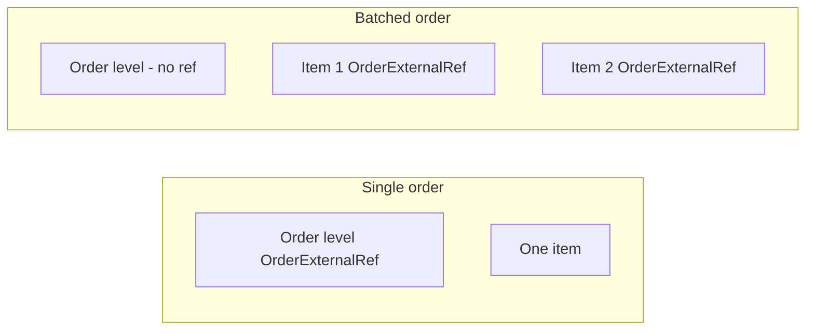
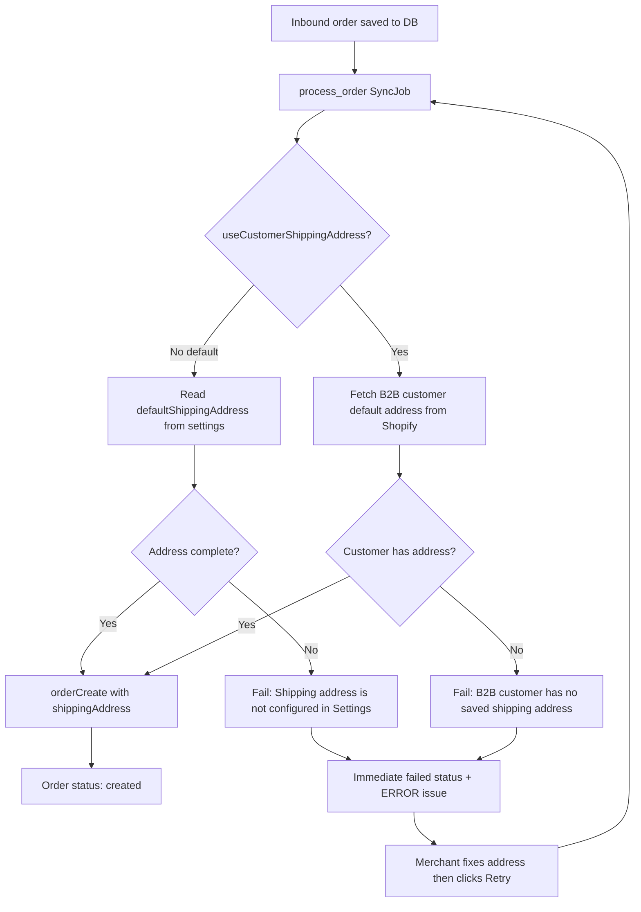
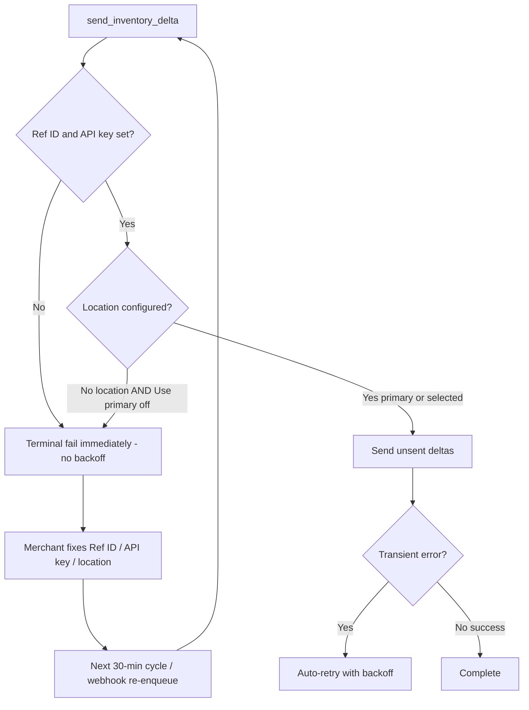
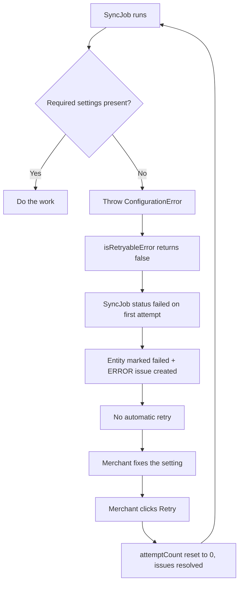

# Order requirements and Settings page plan

## What the KornitX spec requires (inbound orders)

KornitX POSTs orders to your connector. These fields are **sent by KornitX** — you receive and validate them, not configure them for outbound order creation.

| Field | Format | Mandatory | Notes |
|---|---|---|---|
| **Brand** | String | Yes | Fixed: `"Chinti & Parker Ltd"` |
| **ID** | Integer | Yes | KornitX batch/order ID (~8 chars) |
| **ItemID** | Integer | Yes | KornitX line item ID (~9 chars) |
| **EAN** | String | Yes | Barcode; primary product identifier |
| **Currency** | String | Yes | **GBP only** |
| **Quantity** | Integer | Yes | Always **1** for Label Plus |
| **PromiseDate** | `YYYY-MM-DD` | Yes | Customer delivery promise |
| **OrderExternalRef** | String | Yes | Distinguishes **live** vs **pre-emptive** orders |
| **Destination** | String | Yes | Fixed: `"NextRDC"` (RSC confirmed by Next team) |
| **DateTimeStamp** | ISO8601 | Yes | File creation time |

### OrderExternalRef and the 2-letter prefix

From the spec:

> *Reference to differentiate between live customer and pre-emptive orders. Next team will confirm the 2-letter prefix that indicate pre-emptive orders once available.*

- Example value in the doc: `"AB1234567812345"` — first 2 characters are the prefix, remainder is the external reference.
- **Pre-emptive orders** are identified by a **2-letter prefix** that Next will confirm (not finalized in the doc yet).
- **Live customer orders** use a different prefix (or any ref that does not match the pre-emptive prefix).
- The connector stores the prefix in settings once Next confirms it, then classifies each inbound item by checking whether `OrderExternalRef` starts with that prefix.

### Single vs batched shape (affects OrderExternalRef placement)



Already implemented in [`app/services/order.parser.ts`](app/services/order.parser.ts) and documented in [`Learn.md`](Learn.md).

### Auth (inbound webhook — not Settings UI)

- Basic HTTP or OAuth2, agreed with KornitX in advance.
- Currently configured in **`.env`** only (`KORNITX_WEBHOOK_BASIC_*` or `KORNITX_WEBHOOK_OAUTH_TOKEN`).

### Outbound APIs (stock + shipping — partially configured today)

| Requirement | Source today |
|---|---|
| REFID (account code) | Settings `kornitxRefId` (+ env fallback) |
| API key | **`.env` only** (`KORNITX_API_KEY`) |
| Stock PUT URL | `.env` (`KORNITX_STOCK_URL`) |
| Shipping status URLs | `.env` (`KORNITX_SHIPPING_URL` mock / `KORNITX_ORDER_STATUS_BASE_URL` prod) |

---

## What the connector needs to **create Shopify orders**

Today [`workers/lib/create-shopify-order.ts`](workers/lib/create-shopify-order.ts) only requires:

- **B2B customer GID** (`b2bCustomerId`) — already on Settings
- **EAN → Shopify variant** lookup (barcode on tracked products)

**Gaps:**

| Setting | DB column | Status | Purpose |
|---|---|---|---|
| Pre-emptive order prefix | `preemptiveOrderPrefix` | In schema, not in UI/code | Classify live vs pre-emptive; tag orders |
| Next RDC shipping address | `defaultShippingAddress` | In schema, not in UI/code | Default shipping address for `orderCreate` |
| Use customer address toggle | *(new)* `useCustomerShippingAddress` | Not in schema yet | Override: use B2B customer address instead |
| Require prefix toggle | *(new)* `requirePreemptivePrefix` | Not in schema yet | Whether a missing prefix blocks order creation |

---

## Shipping address behavior (updated)

### Checkbox: "Use B2B customer shipping address"

- **DB field:** `useCustomerShippingAddress Boolean @default(false)` — **new Prisma migration required**
- **Default (unchecked):** use the Next RDC address form in Settings
- **When checked:** address form is visually **disabled** (greyed out, not editable); app uses the selected B2B customer's saved Shopify address



### Address form fields (when checkbox unchecked)

Map to existing `defaultShippingAddress` JSON via [`parseShippingAddress`](app/models/app-settings.server.ts):

- Company (e.g. Next RDC name)
- Address line 1, line 2
- City, Province/County, Postcode, Country
- Phone (optional)

**Settings save validation:** When checkbox is unchecked, validate address fields on save (same required fields as runtime). When checked, skip address form validation on save (form values may be stale but are ignored).

Address resolution failures follow the shared configuration-error rule below.

---

## Shared rule: missing settings cause permanent failure (job-specific)

Permanent fail (no auto-retry) is **job-specific**. Order/fulfillment need a manual Retry click; inventory jobs self-heal on the next cycle after the merchant fixes the setting.

### Order + fulfillment jobs (manual Retry required)

| Missing setting | Error message | Jobs |
|---|---|---|
| B2B customer | `"B2B customer is not selected in Settings"` | `process_order` |
| Pre-emptive order prefix (only when "Require prefix" is on) | `"Pre-emptive order prefix is not configured in Settings"` | `process_order` |
| Shipping address — form empty (checkbox off) | `"Shipping address is not configured in Settings"` | `process_order` |
| Shipping address — customer has none (checkbox on) | `"B2B customer has no saved shipping address"` | `process_order` |
| KornitX Ref ID | `"KornitX Ref ID is not configured in Settings"` | `send_fulfillment` |
| KornitX API key | `"KornitX API key is not configured"` | `send_fulfillment` |

Behavior for these: fail immediately → ERROR issue → **no backoff** → merchant fixes setting → clicks **Retry** / **Resend** on Orders page → `attemptCount` resets to 0.

### Inventory delta (`send_inventory_delta`) — permanent blocks only

**Permanent block (no auto-retry)** when any of these is true:

1. No location selected **and** "Use primary location" unchecked
2. KornitX Ref ID missing (Settings and env)
3. KornitX API key missing (`KORNITX_API_KEY`)

Both credentials are required for the Stock API Basic auth (`REFID:API_KEY`) used by delta and full feed.

**Not permanent blockers for delta:** order settings (B2B customer, prefix, address, daily feed toggle). Transient network / HTTP 5xx / throttling still auto-retry.



### Daily full feed (`send_inventory_full_feed`) — permanent blocks + don't-run cases

**Don't enqueue / don't run** (already handled by [`isDailyFullFeedDue`](shared/uk-time.ts) / handler):

1. "Enable daily full inventory feed" is unchecked
2. Feed is enabled **but** no valid UK time is set

**Permanent block (no auto-retry)** when a job runs and any of these is true:

1. No location selected **and** "Use primary location" unchecked
2. KornitX Ref ID missing
3. KornitX API key missing

**Not permanent blockers for full feed:** order settings (B2B, prefix, address).

### Behavior (order jobs)



1. **Centralize detection.** Add a `ConfigurationError` class (e.g. `shared/configuration-error.ts`). [`isRetryableError`](shared/retry.ts) returns `false` for the permanent-block cases above (including Ref ID / API key for inventory + fulfillment).
2. **Immediate terminal failure** when the error is a permanent-block `ConfigurationError`.
3. **ERROR issue** for order/fulfillment permanent failures. Never show a "Nth retry at …" warning for those.
4. **Manual retry** for order/fulfillment only. Inventory has no Retry button — after credentials/location are fixed, the next cycle re-enqueues (see recovery below).
5. **Transient errors unchanged.** Network / Shopify 5xx / throttling still auto-retry with backoff up to 8 attempts.

### Fail-fast placement

- `process_order`: B2B customer, prefix (when required), shipping address — before `orderCreate`
- `send_fulfillment`: Ref ID + API key — before KornitX shipping call
- `send_inventory_delta`: location + Ref ID + API key — before sending
- `send_inventory_full_feed`: skip / complete when feed disabled or no time; permanent-fail on missing location / Ref ID / API key if a job runs

### Inventory recovery after a credentials / location / feed block — answers

**Delta — after the merchant fixes Ref ID, API key, or location, is it picked up in the next 30 minutes?**

Yes, approximately. Flow today:

1. Config misconfig → job fails terminally (no backoff).
2. A later inventory webhook or remaining-unsent path calls [`enqueueSendInventoryDeltaJobIfNeeded`](app/models/sync-jobs.server.ts), which resets a failed job to `pending` with `attemptCount: 0`.
3. Run time is gated by [`computeInventoryRunAfter`](shared/inventory-sync.ts): `lastInventorySyncAt + 30 minutes` (or immediately if never synced / interval already elapsed).
4. Failed runs that never successfully finished do **not** advance `lastInventorySyncAt`, so the next eligible window is still relative to the last **successful** sync — typically within the next ~30 minutes once the setting is fixed and something re-enqueues the job.

**Full feed — after settings are fixed, does it wait until the next scheduled clock time the next day?**

Not always "next day". [`isDailyFullFeedDue`](shared/uk-time.ts) enqueues when all of these are true:

- Feed enabled + valid UK time + location configured
- Current time is **at or after today's** scheduled UK time
- `lastDailyFullFeedAt` is missing **or** is before today's scheduled instant

So if the merchant fixes settings **later the same day** after the scheduled time, and today's feed never completed, the **next worker cycle runs today's feed**. If today's feed already completed successfully, the next run is tomorrow at the set time. If they fix settings **before** today's scheduled time, it waits until that clock time today. Missing Ref ID / API key does not prevent enqueue; the job will permanent-fail until credentials are set, then the next due cycle / same-day re-enqueue path can run again.

### Partial failure: what happens today

**Delta (already correct):** batches that succeed are marked `sent`; failed / remaining rows stay `unsent`. After backoff or the next 30-minute cycle, only unsent rows are sent again.

**Full feed (important):** on mid-run batch failure after some batches already succeeded, the handler:

1. Saves `remainingEans` on the SyncJob payload
2. Calls `failSyncJobWithBackoff` → **retries the remaining EANs with exponential backoff the same night** (5 min, 10 min, … up to 8 attempts) — it does **not** wait until tomorrow's scheduled time for the remainder
3. On success of a later attempt, sends only the remaining EANs, then marks `lastDailyFullFeedAt` and completes
4. If all attempts are exhausted (terminal fail), tomorrow's job uses a **new** idempotency key (`shop:ukDate`) and starts a **fresh full feed of all tracked EANs**, not only yesterday's remainder

No plan change required for partial full-feed handling unless you want a different policy (e.g. never same-night backoff, only next scheduled day). Current behavior = same-night remainder retries, then next scheduled day = full resend of everything.

### Pre-emptive prefix: "Require prefix" checkbox

**Decision: make it configurable** rather than always blocking, since Next has not confirmed the 2-letter prefix yet.

- **New DB field:** `requirePreemptivePrefix Boolean @default(false)` on `AppSettings` (same migration as `useCustomerShippingAddress`)
- **Checkbox off (default):** prefix is optional. Orders process normally; items are tagged `next-live` when no prefix is configured, and no failure occurs
- **Checkbox on:** a missing or invalid `preemptiveOrderPrefix` is a blocking config error for `process_order` only (immediate `failed` + ERROR issue + manual Retry)
- **Placement:** directly under the prefix input, labelled e.g. *"Require prefix before creating orders"* with details *"Turn on once the Next team confirms the pre-emptive prefix."*

---

## Proposed Settings page additions

Add section **"Next Label Plus orders"** on [`app/routes/app.settings.tsx`](app/routes/app.settings.tsx), below **Shopify orders** and above **Inventory sync**.

### 1. Pre-emptive order prefix

- **Field:** 2-character text input (`preemptiveOrderPrefix`); when set, must be exactly 2 letters (stored uppercase)
- **Checkbox:** `requirePreemptivePrefix` — *"Require prefix before creating orders"*, **default off**
- **Help text:** *"First 2 characters of OrderExternalRef for pre-emptive orders. Turn on the requirement once the Next team confirms the prefix."*
- **Runtime use:** Classify items as live/preemptive; add Shopify tags `next-live` / `next-preemptive`. With no prefix configured and the checkbox off, all items are tagged `next-live`

### 2. Shipping address mode

- **Checkbox:** `useCustomerShippingAddress` — label e.g. *"Use B2B customer shipping address"* — **default off**
- **Address form:** Next RDC fields — enabled when checkbox **off**, disabled (greyed, not clickable) when checkbox **on**
- **Help text (unchecked):** *"All KornitX orders use this address on Shopify orderCreate (Destination: NextRDC)."*
- **Help text (checked):** *"Orders use the selected B2B customer's default address from Shopify. Ensure the customer has a saved address."*

### 3. Read-only reference info

- Expected Brand: `Chinti & Parker Ltd`
- Expected Destination: `NextRDC`
- Expected Currency: `GBP`

### 4. Unchanged

- **KornitX API key** — `.env` / Secrets Manager only
- **Inbound webhook auth** — `.env` only
- **B2B customer dropdown** — stays in "Shopify orders" section; required in both address modes

---

## Implementation touchpoints

| File | Change |
|---|---|
| [`prisma/schema.prisma`](prisma/schema.prisma) | Add `useCustomerShippingAddress` and `requirePreemptivePrefix` booleans |
| New migration | Both new columns on `AppSettings` |
| New `shared/configuration-error.ts` | `ConfigurationError` class + central list of config-error messages |
| [`shared/retry.ts`](shared/retry.ts) | `isRetryableError` returns false for every config error; replaces ad-hoc string checks |
| [`shared/order-processing-issues.ts`](shared/order-processing-issues.ts) | Helper for actionable config-failure issue messages ("… then click Retry") |
| [`app/models/app-settings.server.ts`](app/models/app-settings.server.ts) | Extend update type, address validators, `isShippingAddressComplete()` |
| [`app/routes/app.settings.tsx`](app/routes/app.settings.tsx) | New section: prefix + require checkbox, conditional address form, read-only constants |
| [`workers/lib/app-settings.ts`](workers/lib/app-settings.ts) | Extend `validateOrderSettings`; add shared guard used by all handlers |
| New helper e.g. `workers/lib/resolve-shipping-address.ts` | Resolve address from settings JSON or Shopify customer GraphQL |
| [`workers/lib/create-shopify-order.ts`](workers/lib/create-shopify-order.ts) | Accept resolved `shippingAddress`; pass to `orderCreate`; live/preemptive tags |
| [`workers/lib/process-kornitx-order.ts`](workers/lib/process-kornitx-order.ts) | Call address resolver before order create |
| [`workers/lib/handlers/send-inventory-delta-job.ts`](workers/lib/handlers/send-inventory-delta-job.ts) | Permanent-fail guard for location + Ref ID + API key |
| [`workers/lib/handlers/send-inventory-full-feed-job.ts`](workers/lib/handlers/send-inventory-full-feed-job.ts) | Skip when disabled/no time; permanent-fail for location + Ref ID + API key |
| [`workers/lib/handlers/send-fulfillment-job.ts`](workers/lib/handlers/send-fulfillment-job.ts) | Fail-fast Ref ID + API key guard before KornitX call |
| [`About_App_Readme.md`](About_App_Readme.md) + [`Learn.md`](Learn.md) | Document address modes and retry behavior |

### Shopify customer address lookup

Add GraphQL query in [`app/services/shopify-admin.server.ts`](app/services/shopify-admin.server.ts) (or worker equivalent):

```graphql
customer(id: $id) {
  defaultAddress {
    firstName lastName company address1 address2
    city province zip countryCodeV2 phone
  }
}
```

Map to `OrderCreateOrderInput.shippingAddress` format.

---

## Settings page layout (after change)

1. **KornitX** — Ref ID (+ note that API key is in `.env`)
2. **Shopify orders** — B2B customer
3. **Next Label Plus orders** *(new)*
   - Pre-emptive order prefix + "Require prefix" checkbox (default off)
   - Checkbox: Use B2B customer shipping address (default off)
   - Next RDC shipping address form (disabled when checkbox on)
   - Read-only: Brand / Destination / Currency
4. **Inventory sync** — unchanged
5. **Inbound webhook** — unchanged

---

## UAT checklist

- [ ] Next team confirms **2-letter pre-emptive prefix** → enter in Settings and turn on "Require prefix"
- [ ] Next RDC address entered in Settings (checkbox off) → verify Shopify order shipping address
- [ ] Toggle "Use B2B customer shipping address" on → form disabled, order uses customer address
- [ ] Config failure — empty address form → order fails immediately, ERROR issue, no auto-retry
- [ ] Config failure — customer address mode with no saved address → same immediate-fail
- [ ] Config failure — no B2B customer selected → same immediate-fail
- [ ] Config failure — "Require prefix" on with empty prefix → same immediate-fail; with it off, order processes and tags `next-live`
- [ ] Config failure — inventory location unset and "Use primary" off → delta fails fast with no backoff; after fixing location, next ~30-min cycle / webhook re-enqueue succeeds
- [ ] Config failure — missing Ref ID or API key → delta and full feed fail fast with no backoff; after fixing credentials, next cycle succeeds
- [ ] Config failure — full feed disabled or no time set → job not enqueued / completes as nothing_to_send
- [ ] After fixing full-feed settings later the same day (past scheduled time, feed not yet completed) → next worker cycle runs today's feed
- [ ] Partial full-feed batch failure → remaining EANs retried same night via backoff; if exhausted, next scheduled day sends full tracked catalog again
- [ ] Fix order settings → manual Retry on Orders page → order processes successfully
- [ ] Test single + batched payloads; verify live/preemptive tags
