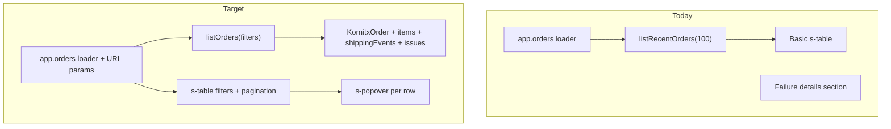

# Orders List Page Redesign

## Goal

Transform the current basic orders table in [`app/routes/app.orders.tsx`](app/routes/app.orders.tsx) into a dashboard-style list matching your screenshots: filters above the table, issue indicator column with click-to-view popover, status badges, pagination with page size, and a **Refresh** header action only.

## Current state

- Single route file with a plain `s-table`, hardcoded `listRecentOrders(100)`, no filters/pagination
- Columns mostly exist in DB but **Shopify order name**, **fulfillment status**, and **structured issues** are missing
- Failures shown in a separate “Failure details” section via `failureReason` — will be replaced by per-row issues



## 1. Database changes

**File:** [`prisma/schema.prisma`](prisma/schema.prisma)

Add to `KornitxOrder`:
- `shopifyOrderName String?` — persist `#1234`-style name when Shopify order is created

Add new model `KornitxOrderIssue`:
- `id`, `orderId` (FK → `KornitxOrder`, cascade delete)
- `type` — `"error"` | `"warning"`
- `message` — human-readable issue text
- `createdAt` — when issue opened
- `resolvedAt DateTime?` — null = active; set when resolved
- Index on `[orderId, resolvedAt]`

Run `prisma migrate dev` for the migration.

## 2. Backend: persist new fields and issue lifecycle

| File | Change |
|------|--------|
| [`workers/lib/orders.ts`](workers/lib/orders.ts) | Update `markOrderCreated(orderId, shopifyOrderId, shopifyOrderName, ...)` to save `shopifyOrderName` |
| [`workers/lib/process-kornitx-order.ts`](workers/lib/process-kornitx-order.ts) | Pass `result.shopifyOrderName` into `markOrderCreated` |
| New: `app/models/kornitx-order-issues.server.ts` | `createOrderIssue`, `resolveOrderIssues`, `listActiveIssuesForOrders` |
| [`workers/lib/orders.ts`](workers/lib/orders.ts) | On `markOrderFailed`: create an **error** issue from `reason` |
| [`app/models/kornitx-orders.server.ts`](app/models/kornitx-orders.server.ts) | On `retryFailedOrder`: resolve active issues + clear `failureReason` (keep existing retry enqueue) |

**Issue rules (v1):**
- **Error** issues created when order processing fails
- Issues **auto-resolve** when order is successfully created or retried and re-processed
- **Warning** type supported in schema/UI; workers can emit warnings later (e.g. fulfillment sync delays) without blocking this UI work
- Backfill migration step: for existing rows with `failureReason` and no issues, insert one active error issue

## 3. Backend: paginated, filterable list query

Replace `listRecentOrders` usage with a new `listOrders()` in [`app/models/kornitx-orders.server.ts`](app/models/kornitx-orders.server.ts).

**URL search params (parsed in loader):**

| Param | Default | Purpose |
|-------|---------|---------|
| `page` | `1` | Current page |
| `pageSize` | `10` | 10 / 25 / 50 |
| `q` | `""` | Search kornitxId, shopifyOrderName, brand |
| `status` | `all` | Order creation status: received / processing / created / failed |
| `shape` | `all` | single / batched |
| `fulfillment` | `all` | Derived status filter |
| `sort` | `newest` | `newest` or `oldest` by `orderReceivedAt` |

**Query returns:**
```ts
{ orders, totalCount, page, pageSize, totalPages, filters }
```

**Include relations:** `items`, `shippingEvents`, active `issues` (`resolvedAt: null`)

**Fulfillment status derivation** (new helper, e.g. `shared/order-display.ts`):
- `pending` — order not yet in Shopify (`status !== "created"`)
- `unfulfilled` — Shopify order exists, no shipping events
- `fulfilled` — has `dispatched` event(s), not all sent to KornitX
- `sent` — all dispatched events have `sent: true`
- `cancelled` — has `cancelled` shipping event
- For batched orders with mixed item states: `partial`

Filter dropdown maps to these computed values in the Prisma `where` clause (via post-filter or conditional SQL — prefer DB-level where possible using `shippingEvents` relations).

## 4. Frontend: page layout (match screenshot)

**Primary file:** [`app/routes/app.orders.tsx`](app/routes/app.orders.tsx)

Extract small helpers into:
- [`app/components/orders/order-status-badges.tsx`](app/components/orders/order-status-badges.tsx) — tone mapping for creation + fulfillment badges
- [`app/components/orders/order-issues-popover.tsx`](app/components/orders/order-issues-popover.tsx) — issue indicator + popover content
- [`app/components/orders/orders-filters.tsx`](app/components/orders/orders-filters.tsx) — filter bar controls

### Header
- Rename page heading to **Orders**
- Add **Refresh** as `slot="secondary-action"` — navigates/revalidates current URL (preserves filters)

### Filter bar (inside `s-table` `filters` slot)
Polaris `s-table` natively supports a `filters` slot ([`TableProps$1.filters`](node_modules/@shopify/polaris-types/dist/polaris.d.ts)).

Controls in one row (wrap on narrow screens via `s-stack direction="inline"`):
1. **Search** — `s-search-field`, placeholder `"KornitX ID, Shopify order, brand..."`, submits via `useSearchParams` + `useSubmit` (debounced ~300ms)
2. **Order Creation Status** — `s-select` (All, received, processing, created, failed)
3. **Shape** — `s-select` (All, single, batched)
4. **Fulfillment** — `s-select` (All, pending, unfulfilled, fulfilled, sent, cancelled, partial)
5. **Date** — `s-select` (Newest first / Oldest first)
6. **Clear** — text button resetting params

Reuse the `readPolarisValue` pattern from [`app/routes/app.settings.tsx`](app/routes/app.settings.tsx) for select onChange handlers.

### Table columns (left → right)

| # | Column | Content |
|---|--------|---------|
| 1 | *(issue)* | Narrow cell: red `s-icon type="alert-circle-filled" tone="critical"` when active issues exist; empty otherwise. Click opens popover. |
| 2 | KornitX ID | `order.kornitxId` (primary column) |
| 3 | Order Creation Status | Uppercase `s-badge` (created=success, failed=critical, processing=warning, received=info) |
| 4 | Shape | `single` / `batched` |
| 5 | Items | `"N item(s)"` count |
| 6 | Shopify Order | `shopifyOrderName ?? "—"` (fallback: last segment of GID for legacy rows) |
| 7 | Received date | `DD/MM/YYYY, HH:mm:ss` locale formatting |
| 8 | Fulfillment status | Uppercase badge from derived helper |
| 9 | Actions | Retry button (failed orders only, existing POST action) |

Remove the old **Failure details** section — issues live in the popover.

### Issue popover (matches screenshot 2)

Use `s-popover` + `interestFor` on a clickable issue icon ([Polaris overlay pattern](node_modules/@shopify/polaris-types/dist/polaris.d.ts)):

```
Open issues (N)
─────────────────
[ERROR badge]  Cancel request failed. ...
09/07/2026, 15:16:45
```

- Heading: `Open issues ({count})`
- Each issue: type badge (`ERROR` → critical tone, `WARNING` → warning tone), message, formatted `createdAt`
- Multiple active issues stacked vertically
- When all issues resolved → icon column empty

### Pagination footer

Use `s-table` built-in pagination props: `paginate`, `hasPreviousPage`, `hasNextPage`, `onPreviousPage`, `onNextPage`.

Add a custom footer row below/alongside for screenshot parity:
- **Left:** `s-select` for page size (10 / 25 / 50) + “orders per page” label
- **Right:** “Page X of Y” text between Previous / Next buttons (update `page` search param)

All navigation updates URL search params so filters + page state are shareable and survive Refresh.

## 5. Documentation

Per workspace rules, update both:
- [`About_App_Readme.md`](About_App_Readme.md) — orders page features (filters, pagination, issues)
- [`Learn.md`](Learn.md) — loader params flow, issue lifecycle, new model

## 6. Testing checklist

- Empty state when no orders match filters
- Search matches kornitxId and shopify order name
- Each filter + sort combination updates URL and results
- Pagination: page size change resets to page 1; boundary pages disable prev/next correctly
- Failed order shows issue icon; popover lists error; retry resolves issue and clears icon
- New Shopify orders persist and display order name (e.g. `#1042`)
- Fulfillment badges update correctly for single vs batched orders
- Refresh preserves current filter/page params

## Out of scope (this iteration)

- “Sync Orders” header button (per your choice: Refresh only)
- Expandable item rows with chevron (can add later; screenshot shows it but not required in your column list)
- Live Shopify Admin fetch for legacy orders missing `shopifyOrderName`
